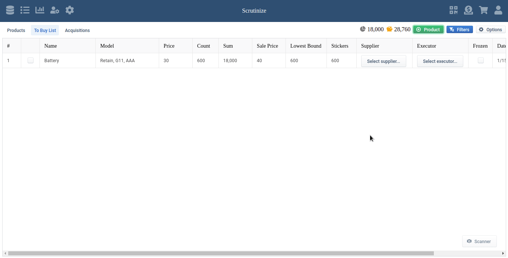

## Intro

The app built for the management of a store that sells electronics. The basic
idea of the app is qr code stickers on the products, which technically allows to
keep the track of sales.

## Showcase

### Authorization with qr code

### Add products to the cart through scanning qr code

### Add products with popover select

### Search in products 

### Easy management of buy list

### Manage qr code stickers 

### Restrict users 

_...and more_

## Tech used

- React
- Typescript (ready, but not type safe yet)
- Evergreen UI
- Styled Components
- React-window
- IndexedDB
- Web workers
- Electron
- Cypress for e2e tests

## Try in production

1. Go to https://scrutinize-crm.netlify.app/
2. In the setup wizard select "Generate dummy data" checkbox to fill out the app
   with demo data

## Warning

`This version is tested only on Google Chrome, it may not fully work on Firefox.`
